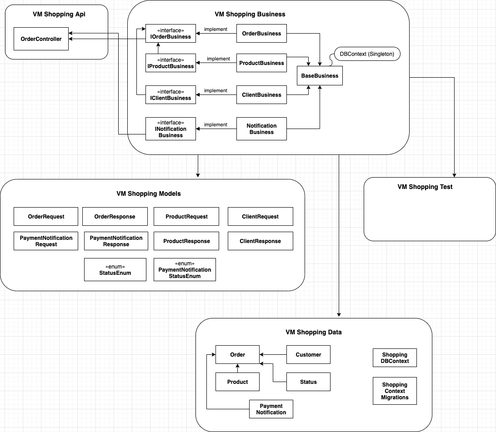
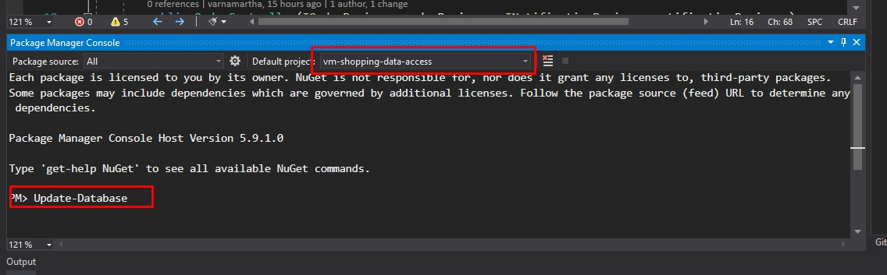
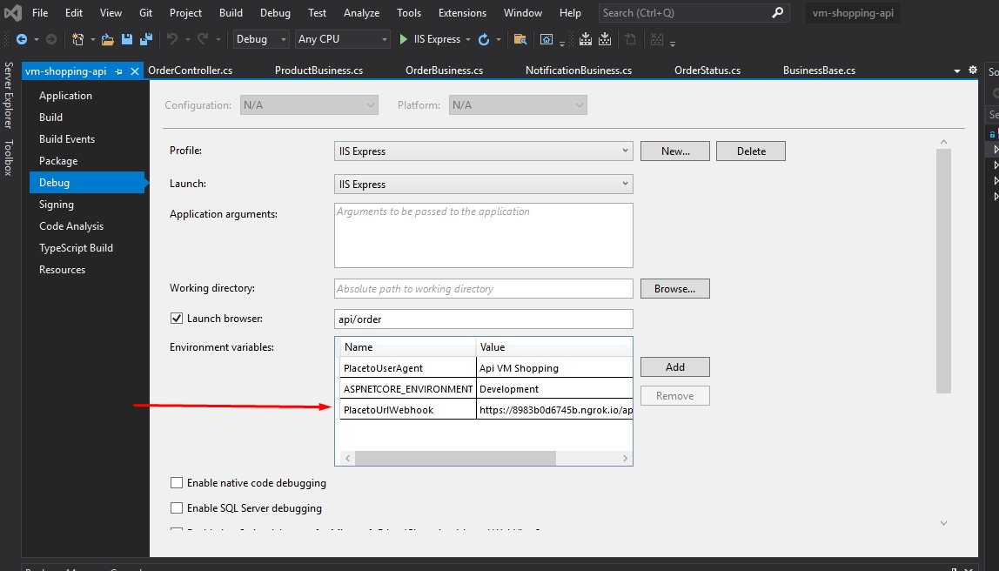

### VM Shopping API

VM Shopping Api automatiza la comunicación para el procesamiento de pagos  Web Checkout con PlacetoPay. Es una solución creada en .NET Core con la estructura que se muestra a continuación.

##### Guía de instalación & ejecución

Pasos para la configuración y ejecución del proyecto:

1. Creación de una base de datos en SQL Server

2. Apuntar cadena de conexión del proyecto **vm-shopping-api** a la base de datos creada en el punto 1

   Fichero "*appSetting.json*"
   {
     "ConnectionStrings": {
       "DefaultConnection": "Data Source=[*ReplaceYourDatabaseAddressHere*],1433;Initial Catalog=Shopping;Persist Security Info=False;User ID=[*ReplaceYourDatabaseUserHere*];Password=[*ReplaceYourPasswordHere*];MultipleActiveResultSets=False;Encrypt=True;TrustServerCertificate=True;Connection Timeout=30"
     }
   }

3. Abrir en Visual Studio la solución 

4. En el **Console Package Manager** seleccionar el proyecto "vm-shopping-data" y ejecutar el migration para la creación de la estructura de base de datos
   

   

5. Indicar una URL de retorno para el Webhook de aviso de PlacetoPay

   

6. Ejecutar el proyecto

7. Para conocer la estructura de las operaciones, así como sus entradas y resultados, acceder a la URL
   "[https://[dominio]/swagger](https://[dominio]/swagger)" 

   

##### Puntos técnicos a destacar

En el proyecto se utilizó un grupo de principios, técnicas y librerías que a continuación se describen para un mejor entendimiento del código fuente 

1. Dependency Injection:

   Se utilizó **inyección de dependencias** para la conexión entre cada una de las clases que necesitaban la lógica implementada en otra, garantizando así un bajo acoplamiento entre ellas.
   Todas las dependencias están resueltas en la clase **DepenciesResolver** del proyecto **vm-shopping-api** a la cual se le hace una llamada en la clase **Startup**

2. Automapper: 
   Se utilizó la librería **AutoMapper** para la conversión entre entidades, dichas conversiones se encuentran en la clase **AutoMapperConfig** del proyecto **vm-shopping-business**

3. Swagger
   Se incluyó documentación de la API con swagger y puede ser visualizada en la ruta "[/swagger](/swagger)"

4. Variables de entorno
   Algunas configuraciones fueron includas en variables de entorno (PlacetoUserAgent y PlacetoUrlWebhook)

5. Uso del controlador de versiones

   Cada feature que se implementó fue desarrollada en una branch individual y fue nombrada con un el prefijo "feature" + "identificador de ticket" (número secuencial que podría ser de utilidad para conocer la función específica d ela que se habla) + "nombre identificativo de la funcionalidad a desarrollar"
   Ejemplo:
   "feature/0004/create-placetopay-request"
   Cada feature fue luego mezclada a la rama principal de desarrollo (develop) vía Pull Request (PR)

6. Se implementaron test unitarios para garantizar un correcto funcionamiento de cada pieza de manera unitaria  